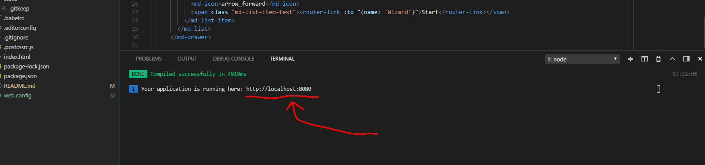

<h1>WebInvokePowerShellFront</h1>

<h2>What is WebInvokePowerShell?</h2>

WebInvokePowerShell is a web application which guides users to provide a powershell script file with arguments. When it has collected all data, the script is run.

This SPA is just a part of an eco-system. There are separate backend and frontend. Backend is a C# WCF-application running on an IIS-instance, front is a SPA made with VueJS (running on another IIS-instance,). Backend is responsible for the main powershell script performance.

<h2>Setup for Development</h2>

There are probably several opinions of the best way to do this, but here is how my computer were set up:

<ul>
    <li>First of all, a great editor for writing SPAs on a windows machine is Visual Studio Code. Visual Studio is free and can be downloaded here: <a href="https://code.visualstudio.com/download">https://code.visualstudio.com/download</a>.</li>
    <li>We also need Node JS (can be downloaded here <a href="https://nodejs.org/en/">https://nodejs.org/en/</a>, event though it is not necessary to do so, I higly recommend you to install it!). Node is a JavaScript runtime engine.</li>
    <li>WebInvokePowerShell-frontend is developed with javascript/ES6, CSS3 and HTML5 assembled in VueJS v2. Installation instructions for VueJS v2 can be found here, <a href="https://vuejs.org/v2/guide/installation.html">https://vuejs.org/v2/guide/installation.html</a>, but in short, run the following command from a powershell terminal:
<code>npm install vue</code> to install Vue.</li>
    <li>When you are up and running (have installed the artifacts mentioned above and fetched this repo from its source code repo), run the following command in order to resolve dependencies:<pre>PS X:\[PATH_TO]\WebInvokePowerShellFront> <code><b>npm</b> install</code></pre></li>
</ul>

Now you should be able to start the dev server:<pre>PS X:\[PATH_TO]\WebInvokePowerShellFront> <code><b>npm</b> run dev</code></pre>

<fieldset>
  <legend>Visual Studio Code-integrated powershell terminal</legend>
  <figure>
        
    <figcaption><code><b>npm</b> run dev</code></figcaption>
  </figure>
</fieldset>

<fieldset>
  <legend>Visual Studio Code-integrated powershell terminal</legend>
  <figure>
        
    <figcaption>Open your browser at this location</figcaption>
  </figure>
</fieldset>

There are many tutorials on how to develop with VueJS but a good start is <a href="https://vuejs.org/v2/guide/index.html">https://vuejs.org/v2/guide/index.html</a>.

<h2>Production</h2>
Since we are using a routing SPA, and are planning to deploy the application to a IIS webserver, there are a few things that has to be taken care of:
<ol>
    <li>We are using the history function of our <code>vue-router</code>. Because of that we need to do some additional setup in IIS before we can use it:
    <ol>
    <li>Install IIS UrlRewrite (<a href="https://www.iis.net/downloads/microsoft/url-rewrite">https://www.iis.net/downloads/microsoft/url-rewrite</a>)</li>
    <li>Create a <code>web.config</code> file in the root directory of the site with the following (<a href="https://router.vuejs.org/en/essentials/history-mode.html">https://router.vuejs.org/en/essentials/history-mode.html</a>):
<pre>&lt;?xml version="1.0" encoding="UTF-8"?&gt;
&lt;configuration&gt;
  &lt;system.webServer&gt;
    &lt;rewrite&gt;
      &lt;rules&gt;
        &lt;rule name="Handle History Mode and custom 404/500" stopProcessing="true"&gt;
          &lt;match url="(.*)" /&gt;
          &lt;conditions logicalGrouping="MatchAll"&gt;
            &lt;add input="{REQUEST_FILENAME}" matchType="IsFile" negate="true" /&gt;
            &lt;add input="{REQUEST_FILENAME}" matchType="IsDirectory" negate="true" /&gt;
          &lt;/conditions&gt;
          &lt;action type="Rewrite" url="/" /&gt;
        &lt;/rule&gt;
      &lt;/rules&gt;
    &lt;/rewrite&gt;
  &lt;/system.webServer&gt;
&lt;/configuration&gt;</pre>
<fieldset>
  <legend>File location</legend>
  <figure>
        
    <figcaption><code>web.config</code> in root</figcaption>
  </figure>
</fieldset>
    </li>
    </ol>
    </li>
    <li>Build the application using <code>npm run build</code> <i>(this step is necessary for every new verion we're planning to release)</i></li>
    <li>In IIS, create new website pointing to the <code>/dist</code> folder of the app.</li>
    <li>In IIS, go to <b>Application Pools</b> > the new website > <b>Advanced Settings</b> > <b>.NET CLR Version</b>, select <code>No Managed Code</code></li>
    <li>Restart IIS.</li>
    <li>The new SPA should work now.</li>
</ol>

<h2>Running the application</h2>
<ol>
    <li>Go to URL: </li>
    <li><h3>Select a script from the list:</h3>
     Example: Click "Next"</li>
    <li><h3>Provide parameters:</h3> Click "Run"</li>
    <li><h3>After a while, you will have output:</h3></li>
</ol>

